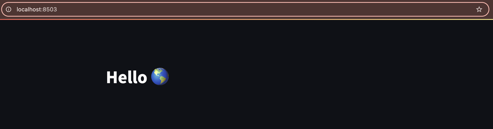
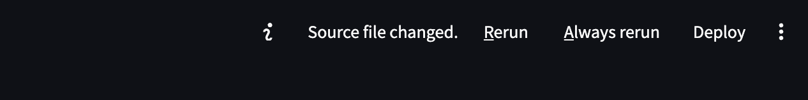

## Building a web-based dashboard for scientific python programs

It's often useful to provide a graphical and interactive front-end
for software, either for running the software itself or for visualizing
results.

**[Streamlit cheatsheet](https://docs.streamlit.io/develop/quick-reference/cheat-sheet)** <- Useful

### Install streamlit with conda
If you are using conda environments, make sure you are in the environment for
our class, and then install streamlit:
```
conda install -c conda-forge streamlit
```
<details>
<summary>gradio is another nice, lightweight python dashboard</summary>
gradio is newer than streamlit, but it targets the same idea: making
interactive web interfaces for python data science tools super fast and easy.
<br><br>
We won't be using this but if you are curious you should check it: <a href="https://www.gradio.app/">gradio.app</a>
</details>

### Testing the install and kicking the tires

Out-of-the-box streamlit comes with a demo that you can run to test if the
install succeeded. Type this command and it should open a new tab in your
web browser.
```
streamlit hello
```

Think about the features in the demo with respect to how you might use things
like this for your own project. For example, the **DataFrame demo** demonstrates
functionality for providing interactive visualization wrapping a pandas dataframe.
And the **Plotting demo** has animated simple a simple line chart but it's animated
so it's more fun. And the code for each demo is provided on the same page, so you can
copy/paste and start tweaking it for your own needs.

You can already see that <u>streamlit provides many basic UI primitives</u> like:

* Check boxes
* Buttons
* Tables
* Charts
* Sliders
* Progress bars
* Text boxes
* [Lots and lots of built-in emoji support](https://streamlit-emoji-shortcodes-streamlit-app-gwckff.streamlit.app/) 🥳🥳🥳
* ... and many many more [interactive widgets you can find in the API docs](https://docs.streamlit.io/develop/api-reference)

## Streamlit HelloWorld (Quickstart)

The first thing we need to know is that Streamlit doesn't play well with jupyter
notebooks, so we will need to develop our dashboards by coding python files in
sublime text. I'm going to open my `hack-5-python` repository in sublime,
because we'll be using some code from this later in the exercise. Create a new file
in this repo called `sl-wf-sim.py` and open it. As usual we'll start with imports:

```python
import streamlit as st
import pandas as pd
import numpy as np
import time # <- We'll need this later as well
```

Next we'll add a `title` text object:
```python
st.title('Hello :earth_americas:')
```

### Running the streamlit dashboard app
Streamlit dashboards run as a 'server' on your laptop, so in order to
run this simple example you need to open a terminal, navigate to the directory
your file is in and type:

```
streamlit run sl-wf-sim.py
```



Very cool! It's incredible how simple it is to go from zero to web site with 
streamlit. Ok, lets close this simple example and try to do something more
interesting. To quit the dashboard go to the terminal and type **Ctrl+c**. 

## Interactive Wright-Fisher Simulation

The good-old Wright-Fisher simulator that we implemented within the `Population`
class will be a good test-case for developing a data science dashboard. It has a
simple, intuitive output (changes in allele frequency through time) that can be
visualized, and it has a small number of parameters that we can make sliders or
input boxes to manipulate.

### Importing our wf `Population` class

We will pull in the wf simulation code we wrote several weeks ago to populate the
dashboard with something interesting. **NB:** If you are anything like me, your most
recent file with wf code was in `wf-script.py`. Python does not like dashes (`-`) in 
module names so if we want to import from this file we need to rename it to
`wf_script.py`. This is my bad, I should have named it this in the first place.

Once you fix that you can import the `Population` class from this file. Also change
the title of the dashboard so it makes more sense.

```
from wf_script import Population

st.title('Simple Wright-Fisher Simulation of Genetic Drift')
```

### Plotting allele frequency through time

For this exercise we will do something a bit different. We will give you the
'bare bones' of the dashboard for the wf simulation, and then we'll give you a
whole bunch of challenges to try to implement on your own (which you can do in
any order you please).

For now, here is the basic code to simulate wf and use streamlit `LineChart`
to show the change through time.

```python
# Create a new Population
# As a reminder these are the default values for population size (N)
# and initial derived allele frequency (f).
# 	N=10, f=0.2
p = Population()

# Initialize the chart with the initial allele frequency of the derived
# allele. `line_chart` expects a list, so we must wrap `p.f` in square
# brackets to pass a list
chart = st.line_chart([p.f])

# Initially we'll run a loop 50 times
for i in range(1, 50):
	# Step 1 wf generation
    p.step(ngens=1)
    # Calculate the current derived allele frequency
    freq = np.sum(p.pop)/len(p.pop)
    # Update the chart to add the current allele frequency
    chart.add_rows([freq])
    # sleep for a small amount of time so you can watch the animation
    time.sleep(0.05)

# Add a button to rerun the simulation
st.button("Rerun")
```

### Save & Execute
Save your file now and execute it in the same way as you did before, and you should
see something much more involved pop up. And it animates! Leave this tab open and
running for now and don't close it unless you know you need to.

### Modifying the code and updating the dashboard
Now that you have got your base dashboard code it's time to start modifying it to
make it do more stuff. Start by changing the value in the `range()` call from 50 to 60. Save the file and go back to the tab with the streamlit app in it. You should see
that the menu on the top-right of the screen has slightly changed:



It has detected the change of the source code and is suggesting to **Rerun** the
the code to incorporate the changes. **This will be very useful for the purpose of making development easier.**

## Challenge section
Now here are a bunch of challenges to implement, to explore the features
of the streamlit library and to make our WF dashboard more interactive.

### Challenge: End the visualization when it stops being 'interesting'
Notice that if the derived allele is fixed or lost (i.e. the allele frequency 
goes to 0 or 1) then the simulation stops doing anything interesting and the
line will get 'stuck' on one or the other of the boundaries. This is desired
behavior, but maybe we want to have the simulation just quit when it detects this.

<details>
<summary>Hint</summary>
Remember that the `Population` class has the attribute `state` which you
can check to see if the derived allele still segregates. There are other
ways to do it as well.
</details>

### Challenge: Add a status message
It might be helpful to have a very simple and immediate summary of the state
of the simulation, rather than having to look at the plot. In this challenge
you will add a status message in the sidebar that reports the `state` of
the `Population` object. Follow the example of the `status_text` object in the
Streamlit `Plotting demo`.

### Challenge: Add a slider to set number of wf generations to simulate
By default the simulations run for 50 generations, but this is a good value that
we might want users to be able to manipulate. Follow the example in the streamlit 
`Animation demo` of how to implement and fetch values from a `Slider` docked in the
sidebar. Sliders take 4 arguments: A label; min value; max value; default value;
and step size.

### Challenge: Add a progress bar
It's also useful to have a progress bar to show the progress of the simulations.
In this challenge you'll implement a progress bar to track the progress of the
simulation. Follow the example of the `progress_bar` variable in the `Plotting 
demo`.

### Challenge: Add sliders to set N and f parameters for the Population
Add sliders in the sidebar to allow users to set the `N` and `f` values for
the population. Follow the examples that use `st.sidebar.slider` in the 
`Animation demo`. See the generations challenge above for details about
slider parameters.

## Deploying streamlit apps
Now you have a pretty cool and functional interactive app! The next step might be
to deploy this app so other people can use it. Streamlit has built-in
functionality to do this in a very simple way with the **Streamlit community
cloud.** Before continuing you'll need to add/commit/push the streamlit dashboard
python file we've been modifying. You'll notice that your dashboard has a 
`Deploy` button in the top-nav menu. If you click this button you'll see 3 different options, one of which is the community cloud. You can click **Deploy Now** and it will take you to the website where you will register your account (you can sign in with your CUID using the google auth method). After you register and connect your google account
and allow streamlit permission to access your github you'll see a setup page which
you can just click through. After you go through this process it will access your
github, point the streamlit server to your dashboard .py file, load it up and
create an endpoint that you can then share with other people! Here is my WF sim
dashboard running in the streamlit community cloud: [wf_sim dashboard](https://iao2122-hack-5-python-notebookssl-wf-sim-vud5cp.streamlit.app/)

Pretttyyyyyyy cooooooooolllllllll!!!!!!!!!!!!

## Wrapping up
With any remaining time, you may think about you could implement a dashboard
for your class project, or you can try copying/pasting and modifying one of
the examples dashboards from the `streamlit hello` demo.


