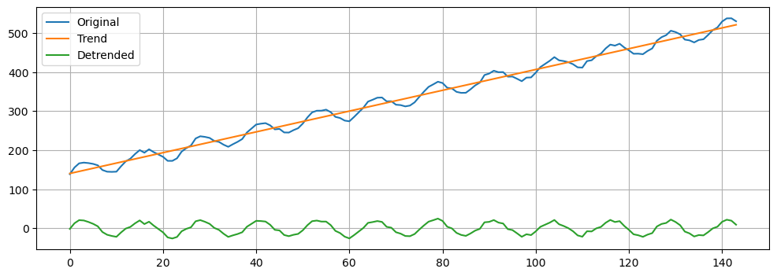

# Python timeseries analysis with statsmodels and ARIMA

## Prerequisites

For this exercise we will need the `statsmodels` and `pmdarima`
libraries.

`conda install -c conda-forge statsmodels pmdarima`

Sources for further exploration:

* [https://www.timescale.com/blog/how-to-work-with-time-series-in-python](https://www.timescale.com/blog/how-to-work-with-time-series-in-python0)
* [https://filippomb.github.io/python-time-series-handbook/notebooks/01/introduction_to_time_series.html](https://filippomb.github.io/python-time-series-handbook/notebooks/01/introduction_to_time_series.html)
* [https://builtin.com/data-science/time-series-python](https://builtin.com/data-science/time-series-python)

## Imports
``` python
import numpy as np
import matplotlib.pyplot as plt
import statsmodels.api as sm
from statsmodels.tsa.seasonal import seasonal_decompose
from statsmodels.tsa.stattools import adfuller
from statsmodels.tsa.arima.model import ARIMA

# One of the modules reports prodigious warnings so we will just hide these ;)
import warnings
warnings.filterwarnings("ignore")
```

# What is time series data?

-   A time series is a sequence of data points organized in time order.
-   Usually, the time signal is sampled at equally spaced points in
    time.
-   These can be represented as the sequence of the sampled values.
-   We refer to this setting as discrete time.

## Time series components

A time series is often assumed to be composed of three components:

* Trend: the long-term direction. 
* Seasonality: the periodic behavior.
* Residuals: the irregular fluctuations.

### Trend
-   Trend captures the general direction of the time series.
-   For example, increasing number of passengers over the years despite
    seasonal fluctuations.
-   Trend can be increasing, decreasing, or constant.
-   It can increase/decrease in different ways over time (linearly,
    exponentially, etc…).

``` python
time = np.arange(144)
trend = time * 2.65 +100
```

``` python
plt.figure(figsize=(12, 4))

plt.plot(time, trend, color='tab:red')
plt.xlabel("Time")
plt.ylabel("Valule")
plt.grid()
plt.title("Trend vs Time");
```


### Seasonality

-   Periodic fluctuations in time series data that occur at regular
    intervals due to seasonal factors.
-   It is characterized by consistent and predictable patterns over a
    specific period (e.g., daily, monthly, quarterly, yearly).

``` python
seasonal = 20 + np.sin( time * 0.5) * 20
```

``` python
plt.figure(figsize=(12, 4))

plt.plot(time, seasonal, color='tab:orange')
plt.xlabel("Time")
plt.ylabel("Value")
plt.grid()
plt.title("Seasonality");
```


### Residuals

-   Residuals are the random fluctuations left over after trend and
    seasonality are removed from the original time series.
-   One should not see a trend or seasonal pattern in the residuals.
-   They represent short term, rather unpredictable fluctuations.

``` python
residuals = np.random.normal(loc=0.0, scale=3, size=len(time))
```

``` python
plt.figure(figsize=(12, 4))

plt.plot(time, residuals, color='tab:green')
plt.xlabel("Time")
plt.ylabel("Value")
plt.grid()
plt.title("Residuals");
```


## Timeseries Models & Decomposition

Time series components can be decomposed with the following models:

* Additive decomposition
* Multiplicative decomposition
* Other more complicated models that we won’t discuss

### Additive model

Additive models assume that the observed time series is the sum of its
components:

X(t) = T(t) + S(t) + R(t)

where:

* X(t) is the time series
* T(t) is the trend
* S(t) is the seasonality
* R(t) is the residual

Additive models are used when the magnitudes of the seasonal and
residual values do not depend on the level of the trend.

``` python
additive = trend + seasonal + residuals
```

``` python
plt.figure(figsize=(12, 4))

plt.plot(time, additive, color='tab:blue')
plt.xlabel("Time")
plt.ylabel("Value")
plt.grid()
plt.title("Residuals");
```


### Multiplicative Model

Assumes that the observed time series is the product of its components:

X(t) = T(t) \* S(t) \* R(t)

Multiplicative models are used when the magnitudes of seasonal and
residual values depends on trend.

``` python
multiplicative = trend * seasonal # * np.abs(residuals) # <- Plotting w/o residuals to show the pattern
```

``` python
plt.figure(figsize=(12, 4))

plt.plot(time, multiplicative, color='tab:blue')
plt.xlabel("Time")
plt.ylabel("Value")
plt.grid()
plt.title("Multiplicative");
```


### De-trending a time series

Now we have seen how to build up a time series from component parts. In
reality this is not the way that it works, typically we will have a
timeseries dataset from observations and we would like to **figure out**
what the different components are. A very simple, yet often useful,
approach is to estimate a linear trend. A detrended time series is
obtained by subtracting the linear trend from the data. The linear trend
is computed as a 1st order polynomial.

``` python
slope, intercept = np.polyfit(np.arange(len(additive)), additive, 1) # estimate line coefficient

trend = np.arange(len(additive)) * slope + intercept # linear trend

detrended = additive - trend # remove the trend
```

``` python
plt.figure(figsize=(12, 4))
plt.plot(additive, label='Original')
plt.plot(trend, label='Trend')
plt.plot(detrended, label='Detrended')
plt.grid()
plt.legend();
```



### Additive Decomposition

Next, we will use
[`seasonal_decompose`](https://www.statsmodels.org/stable/generated/statsmodels.tsa.seasonal.seasonal_decompose.html)
to isolate the main time series components.

We need to specify an integer that represents the main seasonality of
the data. By looking at the seasonal component, we see that the period
is approximately 12 time steps long, so set period=12.

From the
[documentation](https://www.statsmodels.org/dev/generated/statsmodels.tsa.seasonal.seasonal_decompose.html):
“This is a naive decomposition. More sophisticated methods should be
preferred.”

``` python
additive_decomposition = seasonal_decompose(x=additive, model='additive', period=12)
```

``` python
# A helper function to plot the original time series, and the 3 decomposed components
def seas_decomp_plots(original, decomposition):
    _, axes = plt.subplots(4, 1, sharex=True, sharey=False, figsize=(7, 6))
    axes[0].plot(original)
    axes[0].set_title('Original')
    axes[1].plot(decomposition.trend)
    axes[1].set_title('Trend')
    axes[2].plot(decomposition.seasonal)
    axes[2].set_title('Seasonality')
    axes[3].plot(decomposition.resid)
    axes[3].set_title('Residuals')
    plt.tight_layout()
    plt.show()
seas_decomp_plots(additive, additive_decomposition)
```


### Challenge exercise

Implement `seasonal_decompose` for the multiplicative model and evaluate
the results.

# Forecasting with Auto Regressive Integrated Moving Average (ARIMA)

Time series forecasting allows us to predict future values in a time
series given current and past data. Python offers a variety of libraries
and techniques for time-series forecasting, and one popular method is
the autoregressive integrated moving average (ARIMA) model. ARIMA is a
powerful and widely used approach that combines the three following
components to capture the patterns and trends in time-series data: 1.
Autoregression (AR) 2. Differencing (I) 3. Moving Average (MA)

Here, we will use the `pmdarima` package
[ARIMA](https://pypi.org/project/pmdarima/) method to forecast change in
time for our synthetic `additive` dataset, which allows us to forecast
future values in terms of a linear combination of past values.
`statsmodels` also has an
[ARIMA](https://www.statsmodels.org/stable/generated/statsmodels.tsa.arima.model.ARIMA.html)
module but it’s slightly more complicated and `pmdarima` does a lot nice
things to make this method easier for us.

``` python
## Get the length of our input time series
max_x = additive.shape[-1]
max_x
```

    144

### Test/train split

First we need to split our additive data into a test and train set, with
the idea that we will train ARIMA on the train data. Once the model is
fitted, you can use it to forecast future values by calling the predict
method, then we can compare the prediction to the ‘true’ values to see
how well it did.

``` python
# We'll split at index 120, which will leave 24 timepoints to predict in the train set
split_idx = 120

# For plotting we need x-coords for the full dataset so make a list of [1, 2, .., max_x]
xs = list(range(max_x))

# Split the train data and the x-coords
train = additive[:split_idx]
xs_train = xs[:split_idx]

# Split the test data and the remaining x-coords
test = additive[split_idx:]
xs_test = xs[split_idx:]

# Plot the test and train data to see the 'truth' value of the test set
plt.plot(xs_train, train, color = "black")
plt.plot(xs_test, test, color = "red")
plt.title("Train/Test split for additive Data")
plt.ylabel("Value")
plt.xlabel("Time")
```

    Text(0.5, 0, 'Time')


## Train the ARIMA model and predict future values

`auto_arima` has a very similar API to `scikit-learn` which we have seen
previously, with `fit()` and `predict()` methods for the ARIMA model

``` python
from pmdarima.arima import auto_arima

# Train the model on the training data
model = auto_arima(train)
model.fit(train)

# Predict the next n timepoints corresponding to the length of the test set
forecast = model.predict(n_periods=len(test))

# Plot the results
plt.plot(xs_train, train, color = "black")
plt.plot(xs_test, forecast, color = "red")
```


**Pretty Good!**

### Challenge exercise
The ARIMA model does pretty well when the size of the training set is
large (>100 samples) and the size of the forecast is small. Try increasing
the size of the `n_periods` to forecast and plotting this. Think about
how the model will behave as predictions go farther into the future.
How long will it take before the predictions start to look like noise?

**NB:** You will need to update the `xs_test` x-coords like this:
```
# Lets say you want to predict 100 timepoints in the future you can
# update the xs_test x-coords like this
new_test = 100
xs_test = range(max_x, list(range(new_test)))
```

# Challenge exercises

The `statsmodels` library has several different timeseries datasets
built in. Here you will load two different time series example datasets
and work through the analysis that we just practiced above.

-   Plot the two time series.
-   Determine if the time series look like additive or multiplicative
    models.
-   Based on your judgement decompose each time series into component
    parts (assume a period of 12).
-   Split each dataset into test and train sets, train an ARIMA model
    and predict the held-out test set. Compare the prediction to the
    ‘true’ value. How does ARIMA perform on each of these datasets?

``` python
import statsmodels.api as smf
ts_A = sm.datasets.get_rdataset("AirPassengers", "datasets").data["value"].values
print(len(ts_A))
ts_B = sm.datasets.get_rdataset("co2", "datasets").data["value"].values
print(len(ts_B))
```

    144
    468
