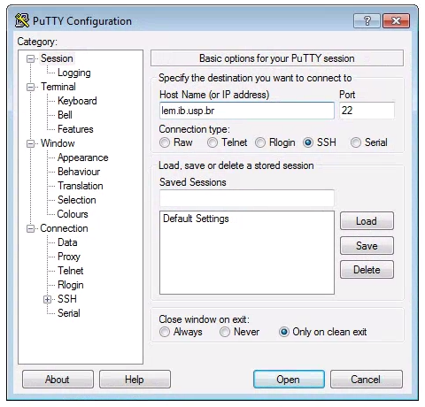
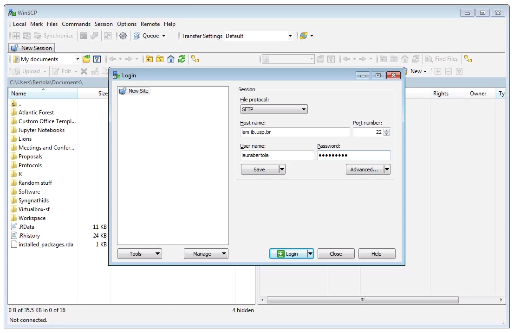
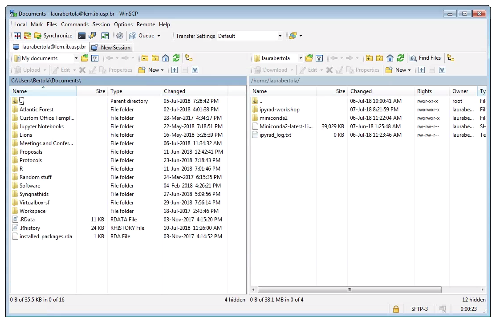
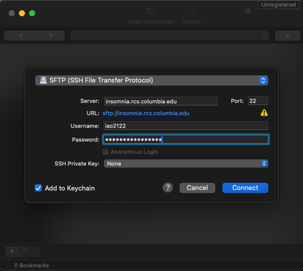

# Parallel computing: Making use of multiple CPUs

Up to this point we have not been focusing too much on optimization
or scaling, meaning to make things run faster and use more resources.
For our in-class projects it's not so important to think about this
because we are (in general) doing simple things that will run quickly on
a single CPU. Today we are going to talk about **scaling computation to
multiple CPUs**.

## Parallel processing with python

Of course you are probably aware your laptop has more than one CPU, and the
question arises: "How do you make your python code **run** with more than
one CPU? Wouldn't that be great!?" Fortunately this is something everyone
wants to do, so there are many libraries for doing this. We will focus on 
`concurrent.futures` from the python standard library. 

You can get more info from the official [documentation page for 
`concurrent.futures`](https://docs.python.org/3/library/concurrent.futures.html).

### How many cores does your laptop have?

You can query the number of cores your laptop has with a simple python
script, or you can even just run this in the python interpreter (probably
easier that way).
```python
import os

os.cpu_count()
```

!!! Notes on terminology
    It is sometimes the case that you'll hear people talk about CPUs, or
    cores, or processors. To a first approximation these are all synonyms
    so for this lesson I will call these 'cores'.

### Getting started with `concurrent.futures`

Let's start with a simple parallel program to calculate the square
of a list of integer values. Open a new text file, rename it `parallel.py`,
and enter this text:
```
import numpy as np
import sys
import time
from concurrent.futures import ProcessPoolExecutor, as_completed

## Use sys.argv to pass in an integer value for the number
## of consecutive integers to operate on
length = int(sys.argv[1])

def task(n):
    time.sleep(1)
    return n * n

if __name__ == '__main__':

    numbers = range(0, length)
    ## create a pool of workers
    ## max_workers determines the number of parallel process to run
    with ProcessPoolExecutor(max_workers=4) as executor:
        ## Submit all the jobs to the executor
        results = [executor.submit(task, num) for num in numbers]

        ## As jobs finish, pull the results and print them
        for future in as_completed(results):
                print(f"Result: {future.result()}")
```
Save this file and open a new terminal and execute this script as we have
done before: `python parallel.py 10` <- The first argument will be the max
value of consecutive integers to operate on.

!!! Notes
    **sys.argv is a quick and dirty replacement for argparse**<br>
    Here we are using the very simple `sys.argv` module for parsing
    command line arguments. `sys.argv[0]` is the name of the executed
    file, and `sys.argv[1]` is the first argument at the command line.

Run this program several times and you should see that the results change
slightly between runs. Here is an example output:

```bash
$ python parallel.py 10
Result: 9
Result: 4
Result: 1
Result: 0
Result: 16
Result: 36
Result: 49
Result: 25
Result: 64
Result: 81
```
In this output you can see the order the tasks were completed in is not
the order that they were created in, the first result is the square of 3,
then 2, then 1, then 0, when the input order was [0, 1, 2, 3, ...]. This is a
good indication that the processes are indeed running in parallel, because
they are returning at different times.

# Introduction to High-Performance Computing

For this exercise we will be using the **Insomnia** cluster at Columbia.
Full documentation for working with this system is available on the
[Research Computing Documentation page](https://columbiauniversity.atlassian.net/wiki/spaces/rcs/pages/62145124/Insomnia+HPC+Cluster+User+Documentation) (you have to log in with your
UNI, for some reason they keep the docs access protected).

## What are HPC systems and how are they used?

### Common structure: Login Node & Compute Nodes

## Logging in with SSH

Most (but not all) HPC systems are accessed through a secure shell
connection (SSH), so in order to work with the Insomnia cluster we'll
need to get an ssh command line client.

### SSH for Mac OS / Linux
On Mac and linux you actually don't need to do anything because there
are native `ssh` clients already installed. You can simply open a terminal
and ssh to the Insomnia cluster like this.

```bash
ssh <UNI>@insomnia.rcs.columbia.edu
```

### SSH for Windows

Windows computers need to use a 3rd party app for connecting to remote computers. The best app for this in my experience is [puTTY](https://www.putty.org/), a free SSH client. Right click and “Save link as” on the [64-bit binary executable link](https://the.earth.li/~sgtatham/putty/latest/w64/putty.exe).

After installing puTTY, open it and you will see a box where you can enter the “Host Name (or IP Address)” of the computer you want to connect to (the ‘host’). To connect to the USP cluster, enter: `insomnia.rcs.columbia.edu`. The default “Connection Type” should be “SSH”, and the default “Port” should be “22”. It’s good to verify these values. Leave everything else as defualt and click “Open”.




### At first login
When you first log in you'll see a welcome message and your prompt will
show something like this, including your username and the name of the login
node you landed on:

```bash
[iao2122@2402-login-002 ~]$
```

## Running interactive mode
The easies way to get going on a compute node is to launch a job in
**interactive mode**, which essentially means to just get a terminal
with some light resources on a compute node. You can use `srun` to start
an interactive mode terminal like this
```bash
# --pty         Give me a 'pseudo-terminal'
# -t 0-2:00     Give me 0 days and 2 hours of compute time
# -A            I am in group 'edu' (the free group)
# /bin/bash     Run this command on the compute node
srun --pty -t 0-2:00 -A edu /bin/bash
```
After you run this command your prompt will change to something like this:

```python
Wed Apr 16 iao2122@ins022 $
```
Indicating that you are now 'on' compute node `ins022`!

!!! Notes
    **Checking on running jobs with `squeue`**<br>
    There are several SLURM commands for querying information about different
    aspects of the cluster. One command you can use to look up information
    about currently running jobs is `squeue`. If you want to know what the
    status of your own running jobs is you can say:
    ```bash
    $ squeue -u iao2122
    JOBID   PARTITION     NAME  USER     ST      TIME  NODES NODELIST(REASON)
    1322802      edu1     bash  iao2122  R       7:22      1 ins022
    ```
    The interesting things here are **ST** which means status, and **R**
    indicates that your job is running (another alternative is **Q** which
    means your job is queued), and **TIME** which shows the *walltime*, or
    how long your job has been running.

    If you say `squeue` with no other arguments it will show a huge list of
    all the running and queued jobs on the cluster. Go ahead and try it!

## Running our first HPC job

Normally when working with HPC systems you will want to run jobs that
take a long time and use lots of resources, so you won't want to run
these in interactive mode. Running a job on the HPC involves writing
a **job submission script** and then calling `sbatch` to submit your
job to the scheduler. Let's try it with a simple Hello World example
first.

Open a new text file with a command line editor called `nano`:
```
nano helloworld.sh
```
Then copy the following text and paste it into the new file. To save
and exit hit Ctrl+x, type 'y' to confirm, and push enter to save.
```
#!/bin/sh
# 
# Simple "Hello World" submit script for Slurm.
#
# When running a real job you would replace `edu` with the ACCOUNT 
# your login has access to, which will provision resources according to
# the allocation of this account.
#
#SBATCH --account=edu            # The HPC account to use
#SBATCH --job-name=HelloWorld    # The job name
#SBATCH -c 1                     # The number of cpu cores to use (up to 160 cores per server as hyperthreading is enabled)
#SBATCH --time=0-0:30            # The time the job will take to run in D-HH:MM
#SBATCH --mem-per-cpu=5G         # The memory the job will use per cpu core

echo "Hello World"
sleep 10
date
# End of script
```

### Structure of an sbatch script
You can see that there is a kind of structure to this job submission script.
There is the **header** which includes the `#!/bin/sh` directive to run
the job as a shell script, and then any notes which are all preceded by `#`
signs indicating that they are comment lines. There is the **config** section
which includes all lines that start with `#SBATCH` which SLURM will interpret
as directives for parameterizing the job. And then there is the **body**
of the script where you can write lines of commands to execute.

### Running a job on the cluster with `sbatch`
Now submit the job like this: `sbatch helloworld.sh`

The `sleep 10` will cause the job to sleep for 10 seconds before exiting, so
you will have time to use `squeue` to see that your job is running. Try
running `squeue -u <uni>` and take note of the `JOBID` assigned to your run.

```
$ squeue -u iao2122
JOBID PARTITION     NAME     USER ST       TIME  NODES NODELIST(REASON)
1322802      edu1     bash  iao2122  R      24:32      1 ins022
```
Here my job ID is 1322802. I can run `squeue` several times, and when my
1322802 job finishes running it will stop showing up in my squeue results.
Now if I do an `ls` I will see a new file called `slurm-1322802.out` which
contains the logged standard output from the run of my job. If you `cat`
this file you should see the results:

```
$ cat slurm-1322802.out
Hello World
Wed Apr 16 09:38:30 PM EDT 2025
```
Because my job script did an `echo` and a call to `date`, I can see the 
"Hello World" and then the time and date at the end time my job completed.

**Congratulations you have just run your first HPC job!**

## Transferring files to/from HPC (sftp)
Hello World was a toy example, so let's try to ramp it up a bit with a
still toy example, but a bit more involved. Let's copy our `parallel.py`
script up to the cluster and then use a job submission script to run
it on multiple cores.

Moving files between the cluster and your local computer is a very common task, and this will typically be accomplished with a secure file transfer protocol (sftp) client. Various Free/Open Source GUI tools exist but we recommend [WinSCP](https://winscp.net/eng/download.php) for Windows and 
[CyberDuck](https://cyberduck.io/) for MacOS.

=== "Windows (WinSCP)"

    **Windows:** After downloading, installing, and opening WinSCP, you will see the following screen. First, ensure that the “File Protocol is set to “SFTP”. The connection will fail if “SFTP” is not chosen her. Next, fill out the host name (`insomnia.rcs.columbia.edu`), your username and password, and click “Login”.

    

    Two windows file browsers will appear: your laptop on the left, and the cluster on the right. You can navigate through the folders and transfer files from the cluster to your laptop by dragging and dropping them. 

    

=== "MacOS (CyberDuck)"

    **MacOS:** After downloading, installing, and opening CyberDuck you will
    choose the "Open Connection" button and you'll see the following screen.
    You'll need to set the protocol to "SFTP", ensure the Port is "22",
    and set the Server as `insomnia.rcs.columbia.edu`. You can also fill
    your username and password here, otherwise you'll be prompted for it.



### Uploading parallel.py
After you get your scp program installed, browse to where you saved 
`parallel.py` and upload it to your home directory on the cluster.

## Challenge: Running your own job on the cluster
Your challenge is to create a new job submission script to run your
`parallel.py` program on the Insomnia cluster. You can start by copying 
your `helloworld.sh` to `parallel.sh` but you'll have to modify it in a
couple ways:

* Change the job name
* Change -c to use more cores (don't use more than 16)
* Modify the section of the code block to run your `parallel.py` program
for a bigger number of integers which you may choose.
* Use `sbatch` to submit your new job

### Sub-challenge: Monitor your job progress
* Use `squeue` to find the job ID of your running `parallel.sh`
* Use `tail -f slurm-<jobID>.out` to 'watch' the progress of the output
of your running job.
